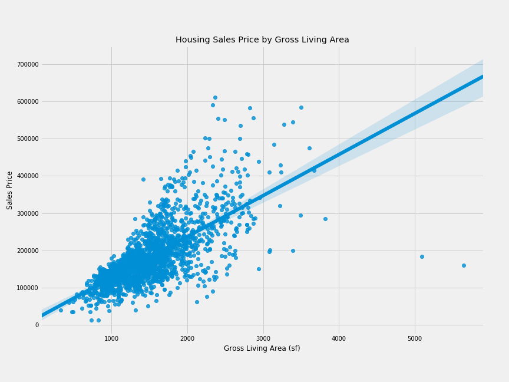
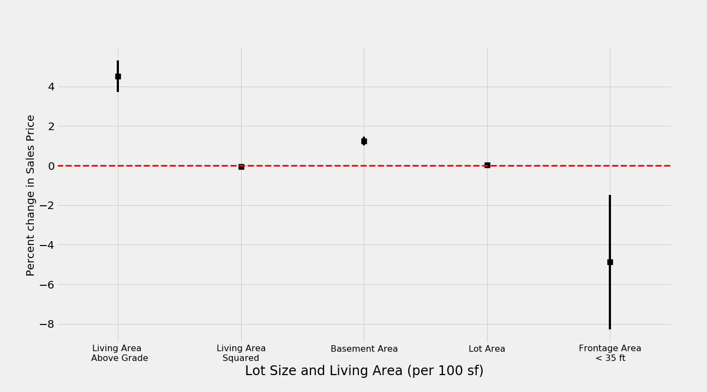
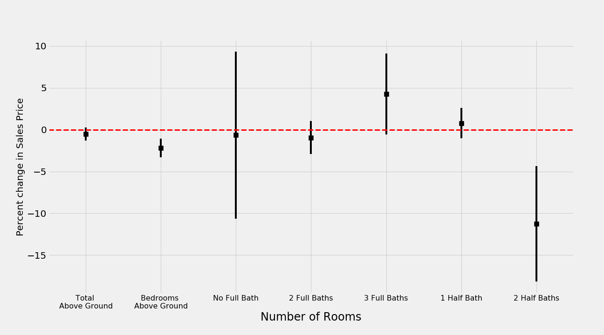
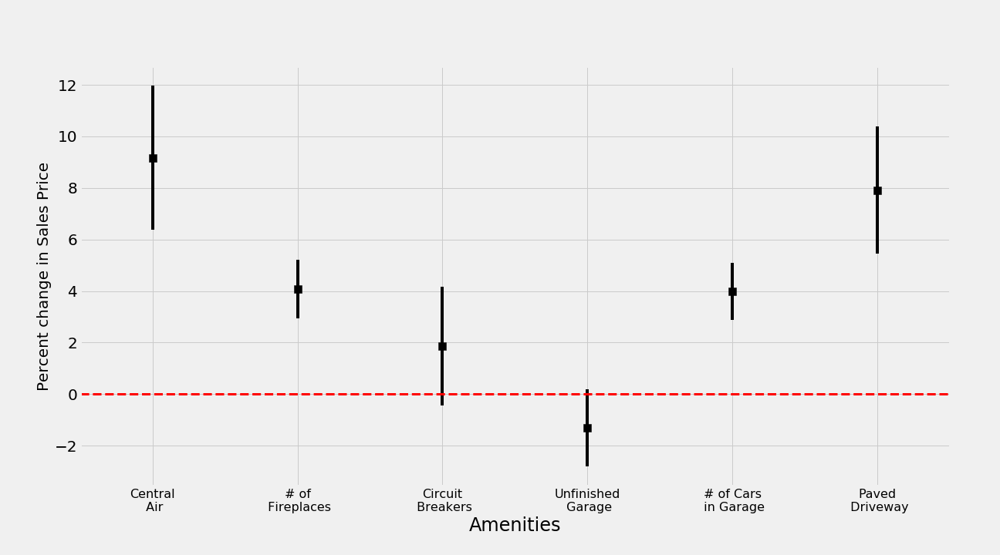
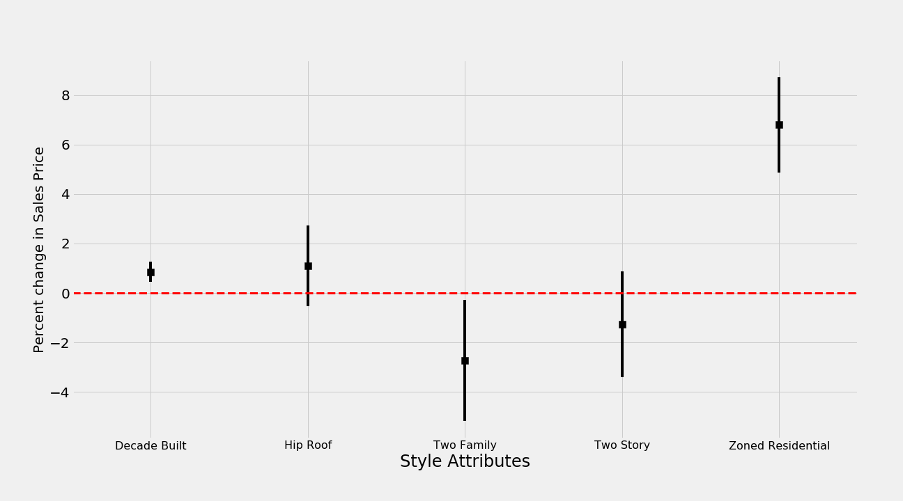
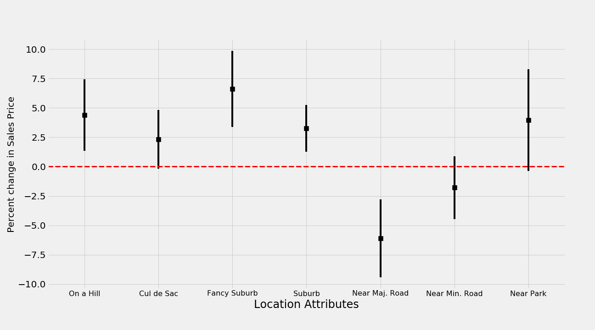
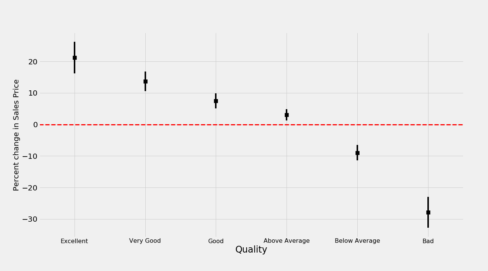
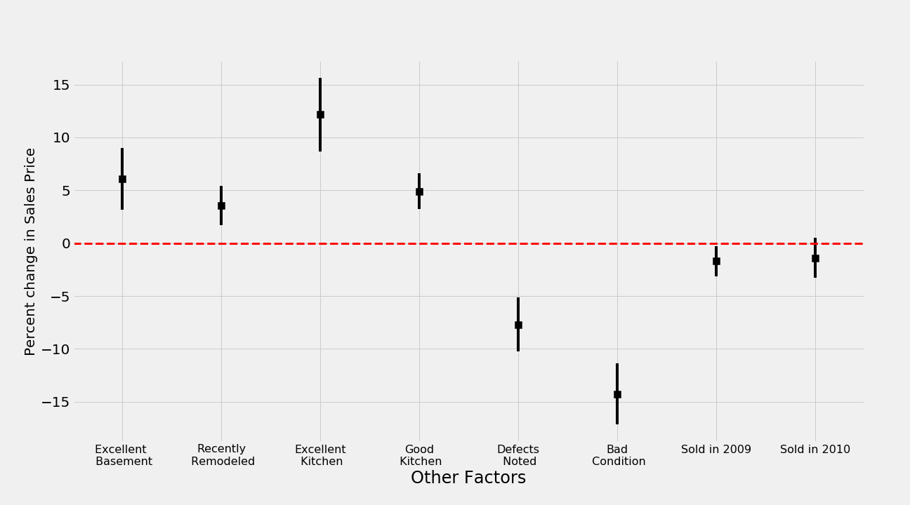

# Project 2 - Ames Housing Data and Kaggle Challenge

Paul Schimek, March 25, 2019

## Overview

This project uses the Ames Housing Dataset to create a regression model that estimates housing sales price. 
The Ames Housing Dataset is an extract of residential property sales prices combined with housing size, 
quality, condition, and type data from the Ames property assesor, for sales between 2006 and 2010. Therere are 81 columns in the dataset. The training dataset has 2,081 observations and the test dataset has 789 observations. (The target variable, SalePrice, was excluded from the test data.) A [description of the data](http://jse.amstat.org/v19n3/decock/DataDocumentation.txt) is available.

## Problem Statement
There are two related goals of this exercise. The first is to build a model that accurately predicts house sales prices in Ames, at least in the testing data. This was measured in part by the Kaggle competition. The second was to create a model using features that are understandable and provide insight into the attributes and features that affect housing prices. In addition to providing usable inferences (e.g., how much people value central air, for example), a model built on features that are based on the analyst's knowledge of the relationships under study may be more robust than a black box model that is principally designed to fit the existing data. This may be more visible when one expands the testing data, such as to other time periods.

## Exploratory Data Analysis

My main goal in EDA was to look for features that seemed to have an impact on the target variable, SalePrice (housing sale price). I did not adjust SalePrice for the Consumer Price Index because price inflation was low during these years (2006-2010) and it was thus unlikely to make much difference. For continuous variables such as measures of living area, lot size, and frontage, I plotted the potential feature against SalePrice. This also allowed me to identify outliers, irregularlities in the data, and possible non-linear relationships.

From examining the data it is clear that the relationship betwen sales price and housing size (e.g., total above ground area) is non-linear: bigger houses cost more money, but the more expensive houses have other features besides size that explain their value. A plot of SalePrice and Gr Living Area (living area above grade) is shown below.

The graph above shows that there are two outliers that had more than 5,000 square feet of living space. Not only were there no other houses of that size in the training data, but the houses sold for price similar to that of much smaller houses. I decided to delete any houses of more than 4,000 sf from the data used to estimate the model.

The column 'Frontage Area' has 330 missing values. These must be true missing data, not "not applicable," since all residential properties must have some frontage along a public road. I decided to impute missing values by using a regression model to predict Frontage using Lot Area. My final model included both Lot Area and its square root, and had an R-sq of 0.45. However, a new Lot Frontage variable with the missing values filled with those prediction by the regression model added nothing to the model of SalePrice. Morever, even a model filtering out the 330 cases with missing values and using only the given data for Lot Frontage resulted in a coefficient that was completely insignificant. I decided not to use Lot Frontage as a continuous variable. However, I found in the Ames Zoning Code that residential uses must normally have a street frontage of at least 35 feet. Therefore I created a dummy variable for properties that had frontage of less that 35 feet. They were not many of them. The smallest frontage in the data was 21 feet.

There were a few variables I used that had a single observation with a missing value; I recoded these to zero. 
For categorical variables (the majority in the dataset), I calculated grouped means and counts by each of the categories. I reviewed this summary to identify cases where the difference in SalePrice among the categories seemed to be significant, the number of observations was not minimal, and the differences seemed to have some logical explanation (in terms of housing size, quality, location, or amenities). Where there was a small number of counts in a category, and/or when categories were similar logically or had similar mean SalesPrice, I collaspsed them into a single dummy. For columns where there were numerous categories that merited separate analysis, I chose either the most common or average value (e.g. in the case of quality rating) as the left-out reference case, for ease of understanding the coefficients. 

I looked at the effect of the year the house was built on sales price. (Ideally I could have changed this into Age, using sales date, but the range of sales dates was narrow and there appears to be considerably uncertainty as to the actual year built for pre-1945 houses, given the clumping around years such as 1900, 1910, 1920.) I tried creating a dummy variable for newly constructed houses, using both 'Year Built' and also using 'Sale Type' = 'new', but these were not remotely close to being statistically significant.

   
## Base Model

I used the transformed variables as described above in my model. A few of the variables I tested were completely insigificant (t-statistics of 0.5 or greater) and I dropped them, except in cases where I wanted to show that there was no impact (e.g. the number of bathrooms). I made two adjustments in order to account for non-linear relationships. I set the dependent variable equal to the log of SalePrice. I included a quadratic (square) term for Gr Living Area (above-ground living areas). 

After some testing of different independent variables, and excluding the two outliers with more than 5,000 sf of living area, I decided to use the following base model:

<table class="simpletable"><caption>OLS Regression Results</caption><tr>  <th>Dep. Variable:</th>         <td>l_price</td>     <th>  R-squared:         </th> <td>   0.897</td></tr><tr>  <th>Model:</th>                   <td>OLS</td>       <th>  Adj. R-squared:    </th> <td>   0.895</td></tr><tr>  <th>Method:</th>             <td>Least Squares</td>  <th>  F-statistic:       </th> <td>   387.8</td></tr><tr>  <th>Date:</th>             <td>Sun, 24 Mar 2019</td> <th>  Prob (F-statistic):</th>  <td>  0.00</td> </tr><tr>  <th>Time:</th>                 <td>14:45:12</td>     <th>  Log-Likelihood:    </th> <td>  1241.4</td></tr><tr>  <th>No. Observations:</th>      <td>  2049</td>      <th>  AIC:               </th> <td>  -2391.</td></tr><tr>  <th>Df Residuals:</th>          <td>  2003</td>      <th>  BIC:               </th> <td>  -2132.</td></tr><tr>  <th>Df Model:</th>              <td>    45</td>      <th>                     </th>     <td> </td>   </tr><tr>  <th>Covariance Type:</th>      <td>nonrobust</td>    <th>                     </th>     <td> </td>   </tr></table>

<table class="simpletable"><tr>         <td></td>           <th>coef</th>     <th>std err</th>      <th>t</th>      <th>P>|t|</th>  <th>[0.025</th>    <th>0.975]</th>  </tr><tr>  <th>const</th>          <td>    9.2885</td> <td>    0.414</td> <td>   22.427</td> <td> 0.000</td> <td>    8.476</td> <td>   10.101</td></tr><tr>  <th>Gr Liv Area</th>    <td>    0.0005</td> <td> 4.03e-05</td> <td>   11.211</td> <td> 0.000</td> <td>    0.000</td> <td>    0.001</td></tr><tr>  <th>live_ar_sq</th>     <td>-4.229e-08</td> <td> 9.69e-09</td> <td>   -4.365</td> <td> 0.000</td> <td>-6.13e-08</td> <td>-2.33e-08</td></tr><tr>  <th>basement_area</th>  <td>    0.0001</td> <td> 1.11e-05</td> <td>   10.998</td> <td> 0.000</td> <td>    0.000</td> <td>    0.000</td></tr><tr>  <th>Lot Area</th>       <td> 3.582e-06</td> <td> 5.29e-07</td> <td>    6.765</td> <td> 0.000</td> <td> 2.54e-06</td> <td> 4.62e-06</td></tr><tr>  <th>frontageLT35</th>   <td>   -0.0488</td> <td>    0.017</td> <td>   -2.808</td> <td> 0.005</td> <td>   -0.083</td> <td>   -0.015</td></tr><tr>  <th>TotRms AbvGrd</th>  <td>   -0.0052</td> <td>    0.004</td> <td>   -1.321</td> <td> 0.187</td> <td>   -0.013</td> <td>    0.003</td></tr><tr>  <th>Bedroom AbvGr</th>  <td>   -0.0218</td> <td>    0.006</td> <td>   -3.849</td> <td> 0.000</td> <td>   -0.033</td> <td>   -0.011</td></tr><tr>  <th>full_bath_0</th>    <td>   -0.0065</td> <td>    0.051</td> <td>   -0.128</td> <td> 0.898</td> <td>   -0.106</td> <td>    0.093</td></tr><tr>  <th>full_bath_2</th>    <td>   -0.0096</td> <td>    0.010</td> <td>   -0.955</td> <td> 0.340</td> <td>   -0.029</td> <td>    0.010</td></tr><tr>  <th>full_bath_3</th>    <td>    0.0426</td> <td>    0.025</td> <td>    1.734</td> <td> 0.083</td> <td>   -0.006</td> <td>    0.091</td></tr><tr>  <th>half_bath_1</th>    <td>    0.0077</td> <td>    0.009</td> <td>    0.828</td> <td> 0.408</td> <td>   -0.010</td> <td>    0.026</td></tr><tr>  <th>half_bath_2</th>    <td>   -0.1127</td> <td>    0.035</td> <td>   -3.208</td> <td> 0.001</td> <td>   -0.182</td> <td>   -0.044</td></tr><tr>  <th>hill</th>           <td>    0.0440</td> <td>    0.016</td> <td>    2.838</td> <td> 0.005</td> <td>    0.014</td> <td>    0.074</td></tr><tr>  <th>culdesac</th>       <td>    0.0233</td> <td>    0.013</td> <td>    1.834</td> <td> 0.067</td> <td>   -0.002</td> <td>    0.048</td></tr><tr>  <th>fancysuburb</th>    <td>    0.0660</td> <td>    0.017</td> <td>    3.995</td> <td> 0.000</td> <td>    0.034</td> <td>    0.098</td></tr><tr>  <th>suburb</th>         <td>    0.0324</td> <td>    0.010</td> <td>    3.213</td> <td> 0.001</td> <td>    0.013</td> <td>    0.052</td></tr><tr>  <th>near_artery</th>    <td>   -0.0611</td> <td>    0.017</td> <td>   -3.605</td> <td> 0.000</td> <td>   -0.094</td> <td>   -0.028</td></tr><tr>  <th>near_feeder</th>    <td>   -0.0179</td> <td>    0.014</td> <td>   -1.314</td> <td> 0.189</td> <td>   -0.045</td> <td>    0.009</td></tr><tr>  <th>near_park</th>      <td>    0.0395</td> <td>    0.022</td> <td>    1.786</td> <td> 0.074</td> <td>   -0.004</td> <td>    0.083</td></tr><tr>  <th>Year Built</th>     <td>    0.0009</td> <td>    0.000</td> <td>    4.031</td> <td> 0.000</td> <td>    0.000</td> <td>    0.001</td></tr><tr>  <th>hip_roof</th>       <td>    0.0110</td> <td>    0.008</td> <td>    1.330</td> <td> 0.184</td> <td>   -0.005</td> <td>    0.027</td></tr><tr>  <th>two_fam</th>        <td>   -0.0273</td> <td>    0.013</td> <td>   -2.180</td> <td> 0.029</td> <td>   -0.052</td> <td>   -0.003</td></tr><tr>  <th>two_story</th>      <td>   -0.0127</td> <td>    0.011</td> <td>   -1.161</td> <td> 0.246</td> <td>   -0.034</td> <td>    0.009</td></tr><tr>  <th>zoning</th>         <td>    0.0680</td> <td>    0.010</td> <td>    6.939</td> <td> 0.000</td> <td>    0.049</td> <td>    0.087</td></tr><tr>  <th>ac</th>             <td>    0.0917</td> <td>    0.014</td> <td>    6.421</td> <td> 0.000</td> <td>    0.064</td> <td>    0.120</td></tr><tr>  <th>Fireplaces</th>     <td>    0.0408</td> <td>    0.006</td> <td>    7.043</td> <td> 0.000</td> <td>    0.029</td> <td>    0.052</td></tr><tr>  <th>breakers</th>       <td>    0.0186</td> <td>    0.012</td> <td>    1.590</td> <td> 0.112</td> <td>   -0.004</td> <td>    0.042</td></tr><tr>  <th>unf_garage</th>     <td>   -0.0131</td> <td>    0.008</td> <td>   -1.713</td> <td> 0.087</td> <td>   -0.028</td> <td>    0.002</td></tr><tr>  <th>num_cars</th>       <td>    0.0398</td> <td>    0.006</td> <td>    6.998</td> <td> 0.000</td> <td>    0.029</td> <td>    0.051</td></tr><tr>  <th>paved_driveway</th> <td>    0.0791</td> <td>    0.013</td> <td>    6.308</td> <td> 0.000</td> <td>    0.055</td> <td>    0.104</td></tr><tr>  <th>concrete</th>       <td>    0.0258</td> <td>    0.010</td> <td>    2.690</td> <td> 0.007</td> <td>    0.007</td> <td>    0.045</td></tr><tr>  <th>exc_qual</th>       <td>    0.2120</td> <td>    0.026</td> <td>    8.307</td> <td> 0.000</td> <td>    0.162</td> <td>    0.262</td></tr><tr>  <th>very_good_qual</th> <td>    0.1365</td> <td>    0.016</td> <td>    8.595</td> <td> 0.000</td> <td>    0.105</td> <td>    0.168</td></tr><tr>  <th>good_qual</th>      <td>    0.0747</td> <td>    0.012</td> <td>    6.269</td> <td> 0.000</td> <td>    0.051</td> <td>    0.098</td></tr><tr>  <th>above_avg_qual</th> <td>    0.0305</td> <td>    0.009</td> <td>    3.270</td> <td> 0.001</td> <td>    0.012</td> <td>    0.049</td></tr><tr>  <th>below_avg_qual</th> <td>   -0.0896</td> <td>    0.013</td> <td>   -7.091</td> <td> 0.000</td> <td>   -0.114</td> <td>   -0.065</td></tr><tr>  <th>bad_qual</th>       <td>   -0.2789</td> <td>    0.025</td> <td>  -11.136</td> <td> 0.000</td> <td>   -0.328</td> <td>   -0.230</td></tr><tr>  <th>exc_basement</th>   <td>    0.0608</td> <td>    0.015</td> <td>    4.104</td> <td> 0.000</td> <td>    0.032</td> <td>    0.090</td></tr><tr>  <th>remodel</th>        <td>    0.0354</td> <td>    0.009</td> <td>    3.743</td> <td> 0.000</td> <td>    0.017</td> <td>    0.054</td></tr><tr>  <th>exc_kitchen</th>    <td>    0.1216</td> <td>    0.018</td> <td>    6.865</td> <td> 0.000</td> <td>    0.087</td> <td>    0.156</td></tr><tr>  <th>good_kitchen</th>   <td>    0.0490</td> <td>    0.009</td> <td>    5.645</td> <td> 0.000</td> <td>    0.032</td> <td>    0.066</td></tr><tr>  <th>damage</th>         <td>   -0.0771</td> <td>    0.013</td> <td>   -5.939</td> <td> 0.000</td> <td>   -0.103</td> <td>   -0.052</td></tr><tr>  <th>bad_condition</th>  <td>   -0.1426</td> <td>    0.015</td> <td>   -9.645</td> <td> 0.000</td> <td>   -0.172</td> <td>   -0.114</td></tr><tr>  <th>2009</th>           <td>   -0.0171</td> <td>    0.007</td> <td>   -2.315</td> <td> 0.021</td> <td>   -0.032</td> <td>   -0.003</td></tr><tr>  <th>2010</th>           <td>   -0.0138</td> <td>    0.010</td> <td>   -1.453</td> <td> 0.146</td> <td>   -0.032</td> <td>    0.005</td></tr></table>

## Model Optimization and Kaggle Competition

I put my variable transformations into a function so I could easily re-run them for the test data. The column names were contained a list that was also re-used for the test data. 

I submitted an early version of my base model to the Kaggle competition. The root mean square error (RMSE) was about $37,000. After some feature improvements and using a log transformation of the target, the RMSE dropped to about $30,000. I then tried polynomial (and interaction) transformations and the use of the LassoCV and RidgeCV models to regularize the coefficients. Although the Ridge model produced a better fit, a CV test using train_test_split showed that it performed terribly on the test data. The Lasso model had much less drop off in performance (and ElasticNet was very similar.) Using the polynomial transformations and regularization, my RMSE dropped to about $27,500, which put me in 12th place.

The inital RMSE scores were based on only 30% of the test dataset, or about 264 observations. This small number of observations was probably a major factor in the very large swings in RMSE between the initial ratings and the final ratings, which were based on the remaining 70% of the data. My RMSE decreased to just under $26,000 in the final scoring. Amazingly, I remained in 12th place, even though some in the top 15 had moved up or down 30 to 90 places in the ratings! I like to think that the relative consistency in my score was due to good feature engineering, but I do not know how to test this except perhaps to compare to the models used by other participants whose inital and final scores varied greatly.

## Interpreting the Regression Coefficients

Plots of regression coefficients are now very common in academic papers. They show the results much more intuitively that lengthy tables of coefficients, standard deviations, t-statistics, and p-values (sometimes acccompanied by stars indicating degree of confidence). I found a recent [blog post](https://zhiyzuo.github.io/Python-Plot-Regression-Coefficient/) where a data scientist who is used to using existing tools in R to create these plots wrote code in Matplotlib to provide similar visuals in Python. I grouped the columns by topic and made separate plots for each topic. (I used Pickle to transfer the model coefficients to a new notebook.) I wrapped my plotting into a function that I called with a subsetted database and the labels to use for axis labels and category names.

Because I used a log transformation of the indepenedent variable (SalePrice), the coefficients can be interpreted as the percent change in sales price due to a 1-unit change in the independent variable. In the case of dummy variables, the coefficient shows the percent change associated withthe presence of the characteristic. 

A multivariate regression model provides estimates of the effect of each independent variable included, controlling for all the others. The coefficient estimates in a well-specified mode can thus be used to give estimates of the effect of features that contribute to or detract from house value. These estimates are of  potential interest to homebuyers, homeowners looking to make improvemnts, developers, realtors, and city planners, among others. 

#### Size

I adjusted the plots so show the percent change per 100 square feet to make them more readable. The marker shows the coefficient estimate and the black line shows the 95% confidence interval around the estimate. The red dashed line on the y-axis represents zero: if a confidence interval crosses this line, the coefficient is not  distinguishable from zero at the 95% confidence level.  

The plot shows that each additional 100 sf of above ground living area is associated with a 4% increase in sales price; the same change in basement area are associated with a 1% increase in sales price. Lots with less than 35 linear feet of frontage (that is, below the normal requirement for residential usage) have about a 5% decrease in value. 

#### Number of Rooms

This plot suggests that each additional room is associated with a small but statistically decrease in value, especially for bedrooms. One explanation of this paradoxical result is that these variables are picking up the effect of room size. Since the model is simultaneously controlling for total square feet, a greater number of rooms means that each room is smaller. Larger rooms are apparently valued highly and are possibly associated with newer, more desirable construction.

The number of bathrooms was entered as a series of dummy variables. The only statistically significant results were that houses with three full baths were more highly valued (although not at the 95% level) compared to houses with one full bath. Houses with two half baths were less highly valued: this may be because there is little value to an additional washroom and people value having multiple bathtubs or showers.

#### Amenities

There are several amenities that are highly valued by homebuyers and account for significant percentage increases in house sales price, all else equal (as is the case with all coefficient estimates). Specifically:

  - Central Air, 9%
  - Paved Driveway, 8%
  - Fireplaces, 4% per fireplace
  - Garage, 4% per car place
  - Circuit Breakers, 2% (but marginally significant)
  - Finished Garage, 1% (also marginally significant) 

### Style

I multiplied the coefficient estimate on Year Built by 10 to give the effect per decade, which is about 1% (positive). This indicates that buyers in Ames prefer newer houses, all else equal. As mentioned earlier, there was no significant effect on price of a brand-new house. One reason is that preferences for newer housing may already be accounted for in variables described previously such as larger living areas, more garage bays, and more full baths. Another newer construction style is the hip roof, which is associated with a 1% increase in value (although not statistically significant). Ames buyers put a premium on single-family houses, which are worth 2% more than two-family houses (including townhouses). The few houses that were not on land zoned for residences were worth almost 7% less than comparable houses in residential zones. This might be a cost of the constraints imposed by the zoning regulation, or it might be a reflection of proximity to industrial and other other disfavored land uses (and thus really a location effect). 

#### Location

Location of course has a large impact on house value. Buyers have preferences for houses in specific neighborhoods (here I grouped the most expense ones as "fancy suburb" and the next most as "suburb," with the reference case being everywhere else. In addition, buyers value houses on a hill, near a park, on a dead-end street, and away from major roads. (Some of these effects were only marginally significant.)

#### Quality

The Ames assessor provided an estimate of overall quality for each property. Very few (23 properties) were coded in the top category of "very excellent," so I combined it with the "excellent" category. Only 42 were rated in the bottom three categories, so I grouped these together as "bad." I used "average" as the reference category. Each higher rating is associated with an increase in value, suggesting that the assessors do a good job estimating housing quality. The extreme ratings show the largest effects of all the variables in the model: an excellent rating is associated with a 20% increase in value and a bad rating is associated with a nearly 30% decrease in value. 

### Other

There were some other condition and quality factors that I included in the model. An "excellent" basement was associated with a 6% increase in value (compared to any other rating). An "excellent" kitchen was good for a 12% increase in sales price and a "good" kitchen was worth 5% (each of these in comparison to a kitchen rated less than good). I used the Year Remodeled variable to create a dummy to identify houses that had recently been remodeled: this was associated with a 3.5% increase in value. 

I also looked at the year in which the house was sold. There was an average decrease in sales price of 1.7% in the recession year of 2009 compared to the other years in the data. This is a very modest impact; perhaps the explanation is that prices had not increased rapidly in Ames in the years leading up to the recession compared to other areas of the country. 

---

## Conclusions
There were numerous technical items I learned from this project:
  - how to use functions as part of my variable transformations
  - how to impute missing values using a regression model
  - how to 'pickle' model results and lists for use in other notebooks (later I will figure out how to create modules so I can reuse functions)
  - how to create graphs of regression coefficients using Matplotlib
  - how to optimize models via scaling, polynomials/interactions, and regularization.
  
  
Others developed models with lower RMSE on the test data, and I am curious to see what techniques they used. I wonder, though, if more 'optimized' models are more transferable to test datasets that are not very similar to the training data (e.g., not randomly sampled from the total data available). 

I think the 'business' conclusions about locations, amenities, quality, and other attributes that users value are interesting, but many may be specific to the time and place of the Ames data. An even richer dataset, with tens of thousands of observations, would provide even more information to tease apart the attributes of housing that are valued, even though many of them are observed together. In that way it might also provide a more generalizable model.
